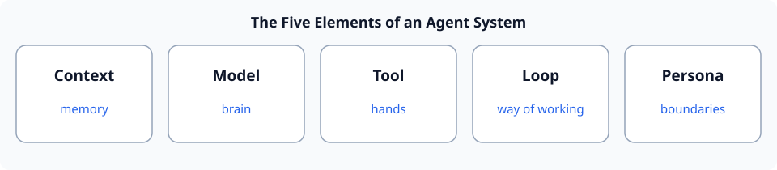

# Chapter 3: The Five Elements of an Agent System

> This is the most important "map" in the whole course. However complex an agent system may be, it decomposes into **five things**. Remember these five, and every later chapter will fall into place.

**One-sentence analogy**: An agent is a lot like **a person**. A person has memory, a brain, hands, a way of working, and a character. So does an agent.

| Element | English | Analogy | What it governs |
|---|---|---|---|
| **① Context** | Context | memory | What it "knows" (dialogue, tool results, rules) |
| **② Model** | LLM | brain | How it "thinks" (understand, reason, output) |
| **③ Tool** | Tool | hands | What it can "do" (read files, run commands, look up data) |
| **④ Loop** | Loop | way of working | How it "moves step by step" (think→act→observe→think) |
| **⑤ Persona** | Preset/Persona | character & boundaries | How it "should behave," what it may or may not do |

## 3.1 Context — memory {#sec-1}

**Context** = all the information an agent can see at a given moment: system rules, what you said, what the model said earlier, and tool results.

It is the agent's "memory." If the context is lost, the model "amneses" — it forgets what you just asked it to do and how far it had gotten. **How to organize context and how to keep it from growing too long** is a later focus (Part 1 §1, Part 4 §2).

## 3.2 Model (LLM) — brain {#sec-2}

**Model** = the LLM responsible for "understand + reason + generate." It is the agent's "brain."

Which model you choose and how you tune it (e.g., "temperature") affect whether it is more "divergent" or more "rigorous." But note: a model **only thinks**; it needs tools to "do" (Part 1 §2).

## 3.3 Tool — hands {#sec-3}

**Tool** = an external capability a model can call but can only perform through code you provide: reading files, running commands, browsing the web, computing… It is the agent's "hands."

Tools turn a model from "can only talk" into "can do." How to define a tool and how to make a model use it correctly is the core (Part 1 §3, Part 3).

## 3.4 Loop — way of working {#sec-4}

**Loop** = the mechanism that repeats "think → invoke tool → observe result → think again" until the goal is met. This is the fundamental difference between an agent and a chatbot.

Without a loop, a model can only "answer once"; with one, it can "get the job done step by step" (Part 1 §4).

## 3.5 Persona (Preset / Persona) — character & boundaries {#sec-5}

**Persona** = the agent's **identity and rules**: is it a "research assistant" or "customer service"? Which words to say, which operations to refuse, where the boundary lies?

The persona lives in the "system prompt" and shapes the agent's behavior and discretion (Part 3 §3).

---

## Checklist {#sec-6}

- [ ] Can recite the **five elements**, and give each a one-line "analogy + what it governs."
- [ ] Can point out the division between **model** and **tool** (one thinks, one acts), and the relation between **loop** and **context** (the loop tracks progress through context).
- [ ] When you encounter any agent system, can name what each of the five is.

**Follow-up** (look back at §3.4 if stuck): Why is the "loop" the dividing line between an agent and a chatbot? What is missing from a "model + tool" without a loop?
