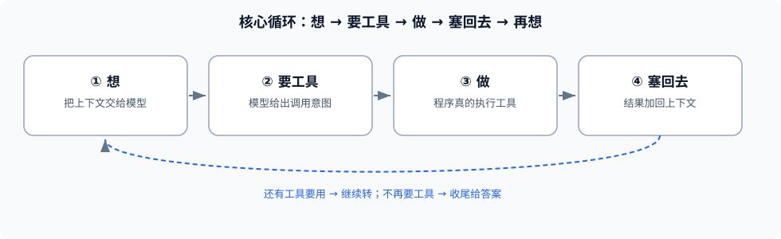

# Chapter 4: The Agent Loop — Its Way of Working

> This is the **most central chapter in the whole course**. We have prepared the memory (context), the brain (model), and the hands (tools); in this chapter we set them spinning. Understand and write this loop, and you have truly crossed the threshold from "chatbot → Agent."

---

## 4.1 The complete flow of the loop {#sec-1}

**In plain terms**: the way an agent works is to **ask itself four questions over and over**:

```
① What should I think about now?   → hand the context to the model
② Which tool does it want?         → the model gives a "call intent" (or answers directly)
③ Did the tool finish? What is the result? → your program actually executes and gets the result
④ Stuff the result back and think again.  → add the result to context, back to ①
```

Keep spinning until the model says "I've got it, no tool needed," then wrap up. This pipeline is called the **Agent Loop**.



Where each step maps in code:

| Step | Code action |
|---|---|
| ① think | call Provider's `chat(messages)` |
| ② want a tool | check whether the return has `tool_calls` |
| ③ do | execute the corresponding tool's `handler` |
| ④ stuff back | append the tool result as a message to `messages`, into the next turn |

---

## 4.2 How the model decides "which tool" {#sec-2}

**In plain terms**: you do not have to teach it "when to use" — you just **hand it the tool list (name + description + parameters)**, and it judges "this step needs to read a file" and then names `read_file`.

**Technical**: in the model's returned response, the `tool_calls` field is an array; each item contains a **tool name** and **arguments**:

```json
{
  "role": "assistant",
  "tool_calls": [
    { "id": "call_1", "function": { "name": "read_file", "arguments": "{\"path\":\"config.json\"}" } }
  ]
}
```

### 4.2.1 Parse the tool-call intent

```ts
const msg = await chat(messages, { tools: toolList })
if (msg.tool_calls?.length) {
  for (const call of msg.tool_calls) {
    const args = JSON.parse(call.function.arguments)
    const result = await runTool(call.function.name, args)   // see 4.2.2
    messages.push({ role: 'tool', tool_call_id: call.id, content: JSON.stringify(result) })
  }
} else {
  return msg.content   // no tool call → wrap up, answer directly
}
```

### 4.2.2 Execute and feed the result back

**Key**: when executing a tool, **you must catch errors** (Chapter 3 §3.3). On failure, feed back `{ ok:false, error }` so the model can adjust, rather than crashing the program.

**Also control length**: before feeding a tool result back (say, "read a large file"), set a **length limit** and truncate/summarize; otherwise a single call may blow up the context (see Part 4 §2).

### 4.2.3 Continue or wrap up

- The model **still wants a tool** (`tool_calls` non-empty) → continue to the next turn;
- The model **no longer wants a tool** (gives final text) → wrap up and return.

---

## 4.3 When the loop terminates {#sec-3}

Newcomers fear "infinite loops." All three termination conditions are needed:

### 4.3.1 Goal reached

The model gives a final reply and no longer requests tools — **a normal wrap-up**.

### 4.3.2 Max steps / timeout

Set a **max turn count** (e.g., 20 steps) and a **per-step timeout**; stop when reached, to avoid spinning forever. **This is a life-saver; it must be there.**

```ts
const MAX_STEPS = 20
for (let step = 0; step < MAX_STEPS; step++) {
  // ...one loop iteration...
}
```

### 4.3.3 Error fallback

- Model interface errors → retry or return an error;
- A tool repeatedly fails → tell the model "try another way" or stop directly;
- Argument parsing fails → feed the error back to the model and let it resend.

---

## Checklist {#sec-4}

- [ ] Can recite the loop's **four steps** (think → want a tool → do → stuff back).
- [ ] Can state that the model **does not execute** tools; it only outputs **call intent**.
- [ ] Can write the core **parse `tool_calls` → execute → feed back** code skeleton.
- [ ] Knows the **three termination conditions** the loop needs at minimum, and can set `MAX_STEPS`.

**Follow-up** (look back at §4.3.2 if stuck): if the model falls into an infinite loop of "reading the same file again and again," which mechanism do you use to pull it out?
