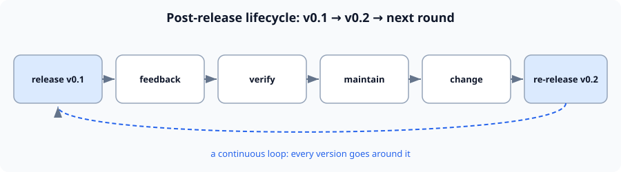

# Chapter 7: Retrospective and the Next Round

> The last chapter. v0.2 is out, but the story does not end — **the post-release lifecycle is a continuous loop.** This chapter covers how to retrospect and how to begin the next round.

---

## 7.1 Collecting v0.2 feedback {#sec-1}

**In plain terms**: once the new version is out, ask two questions next:

1. **Did this version solve the problem?** (verify the change worked)
2. **Did it introduce new problems?** (regression, compatibility)

**Technical**: for every change that "went into v0.2," **verify that it actually resolved the original feedback** — do not "change it without solving it."

---

## 7.2 Updating the roadmap and priorities {#sec-2}

**In plain terms**: based on the new feedback, re-rank "what to do in the next version."

**Technical**:

- update the **roadmap** (what goes into v0.3, what is cut);
- state the **maintenance commitment** (which version is supported long-term);
- record "**what was not done this time, and why**," to avoid repeated debate.

---

## 7.3 Back to the loop {#sec-3}

**In plain terms**: then **go around again**: feedback → verify → maintain → change → re-release v0.3…

**Technical**: **the post-release lifecycle is a continuous closed loop**, not a one-off task. Each turn makes the system more stable and better aligned with real needs.



```
release → feedback → verify → maintain → change → re-release → (back to feedback)
  ↑__________________________________________________________|
```

> **【do】** Only by actually going around this loop once or twice can you turn "knowledge" into "ability."

---

## Course wrap-up: how far you have come from zero {#sec-4}

- You understand the **five elements** of an agent and its overall architecture;
- You wrote the **core loop, tools, skills, and personas** by hand;
- You built a mini-harness with **memory, security, and pluggability**;
- You made it **callable, acceptable, and publishable**;
- You went through the complete lifecycle of **release → feedback → verify → maintain → change → re-release**.

**"Able to write it yourself" — achieved.**

## One last honest word {#sec-5}

The course can give you **knowledge and method** (the parts marked 【learn】, which I tried my best to cover fully);
but **"actually ship a version, have it used, hit problems, fix them, and ship again"** (the parts marked 【do】) —
**only you can walk through.** No course, however complete, can give you that feel.

**Go ship your v0.1.**

---

## Checklist {#sec-6}

- [ ] Can state the **two questions** a retrospective asks (solved? new problems?).
- [ ] Can update the roadmap and be explicit about "what not to do."
- [ ] Understands that "the post-release lifecycle is a continuous closed loop."
- [ ] Knows that the next step is to genuinely walk through the loop once.
