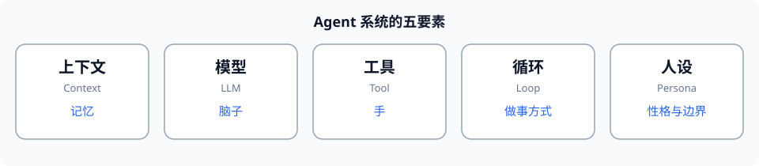

# 第3章 Agent 系统的五要素

> 这章是全书最重要的一张"地图"。一个 Agent 系统再怎么复杂，拆开就是**五样东西**。把这五样记住，后面每一章都能对号入座。

**一句话比喻**：一个 Agent 很像**一个人**。人有记忆、有脑子、有手、有做事的方式、有性格。Agent 也一样。

| 要素 | 英文 | 比喻 | 它管什么 |
|---|---|---|---|
| **① 上下文** | Context | 记忆 | 它"知道"什么（对话、工具结果、规则） |
| **② 模型** | LLM | 脑子 | 它怎么"想"（理解、推理、输出） |
| **③ 工具** | Tool | 手 | 它能"做"什么（读文件、跑命令、查资料） |
| **④ 循环** | Loop | 做事的方式 | 它怎么"一步一步推进"（想→做→看→再想） |
| **⑤ 人设** | Preset/Persona | 性格与边界 | 它"该"怎么表现、该不该做某事 |

---

## 3.1 上下文（Context）—— 记忆

**上下文** = Agent 在某一刻**能看见的所有信息**：系统规则、你说的话、模型自己说过的话、工具返回的结果。

它是 Agent 的"记忆"。如果上下文丢了，模型就会"失忆"——忘记你刚让它干嘛、前面做到哪了。**上下文怎么组织、怎么避免太长**，是后面重点（第一部分第1章、第四部分第2章）。

## 3.2 模型（LLM）—— 脑子

**模型** = 那个负责"理解 + 推理 + 生成"的 LLM。它是 Agent 的"脑子"。

选哪个模型、怎么调参数（比如"温度"），会影响它是更"发散"还是更"严谨"。但注意：模型**只会想**，得靠工具才能"做"。（第一部分第2章）

## 3.3 工具（Tool）—— 手

**工具** = 模型能调用、但只能靠你提供的**外部能力**：读文件、跑命令、查网页、算数……它是 Agent 的"手"。

工具让模型从"只会说"变成"能做"。工具怎么定义、怎么让模型用对，是核心（第一部分第3章、第3部分）。

## 3.4 循环（Loop）—— 做事的方式

**循环** = 把"想→调工具→看结果→再想"反复转起来的机制，直到目标达成。这是 Agent **和聊天机器人的根本区别**。

没有循环，模型只能"答一次"；有了循环，模型才能"一步步把活干完"。（第一部分第1章）

## 3.5 人设（Preset / Persona）—— 性格与边界

**人设** = Agent 的**身份与规则**：它是"科研助手"还是"客服"？哪些话该说、哪些操作该拒绝、边界在哪？

人设写在"系统提示词"里，决定 Agent 的行为与分寸。（第3部分第3章）

---

## 验收清单

- [ ] 能背出/复述 **五要素**，并给每个说一句"比喻 + 管什么"。
- [ ] 能指出：**模型**和**工具**的分工（一个想、一个做）；**循环**和**上下文**的关系（循环靠上下文记进度）。
- [ ] 看到任何一个 Agent 系统，能说出它这五样分别是什么。

**追问**（答不上来就回看 3.4）：为什么说"循环"是 Agent 和聊天机器人的分水岭？没有循环的"模型+工具"缺了什么？
