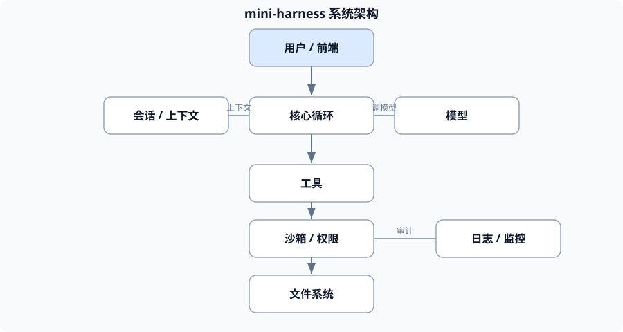

# 第1章 需求与架构设计

> 结课项目开始了。但**别急着写代码**——先想清楚"要做什么、不做什么、怎么分块"。这一章是"动工前的图纸"。

---

## 1.1 明确目标与边界

**大白话**：先回答三个问题：

1. **要它干什么**？（比如"帮我把一个文件夹里的 Markdown 整理成一份汇总报告"）
2. **不干什么**？（比如"不做联网搜索""不碰工作区外文件"）
3. **做到什么程度算完成**？（有产物、能验收）

**专业**：**需求边界**决定了后续所有设计。**"不做什么"和"做什么"同样重要**——边界不清，系统就会无限膨胀。

**要点**：写一份**一页纸的需求说明**：目标、非目标、验收标准。

---

## 1.2 画架构图

**大白话**：把系统的"零件"和"它们怎么连"画出来，一眼看懂。



**专业**：架构图至少画清楚**五要素**的位置：

```
[用户/前端]
     │
     ▼
[会话/上下文] ──► [核心循环] ──► [模型]
     ▲                │
     │                ▼
     └────────── [工具] ──► [沙箱/权限] ──► [文件系统]
                      │
                      ▼
                 [日志/监控]
```

**要点**：**先画图、再写码**。图能暴露"哪里缺了、哪里绕了"。

---

## 1.3 模块划分与依赖

**大白话**：把图上的零件变成"一个个包"，并说清谁依赖谁。

**专业**：按第七部分的分包原则：

```
core（循环/上下文/会话）
 ├── 依赖 llm（模型适配）
 ├── 依赖 tools（工具）
 └── 依赖 sandbox（权限）
cli / web（入口）→ 依赖 core
```

**要点**：**依赖要单向、无环**。core 不该反过来依赖 cli。**依赖乱了，系统就散了。**

---

## 验收清单

- [ ] 能写出**一页纸需求**（目标 / 非目标 / 验收标准）。
- [ ] 能画出包含**五要素**的架构图。
- [ ] 能做出**模块划分**并保证**依赖单向无环**。

**追问**（答不上来就回看 1.1）：为什么"明确不做什么"和"明确做什么"一样重要？不写"非目标"会有什么后果？
